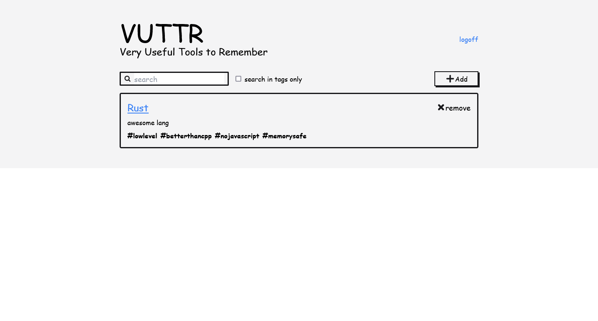

# VUTTR

## Very useful tools to remember

[](./readme_data/demo.mp4)

to run on your local machine you just need to install node, yarn and docker if you pretend to run the database inside a container

after everything is installed, run:

```sh
// to create a database container
$ docker-compose up -d
// after that you need to remove the ".example" extension from the enviroment files and add your eviroment variables
$ mv .env.example .env
$ mv .env.local.example .env.local

// apply the database migrations
$ yarn prisma migrate dev
// run the app
$ yarn dev
```
